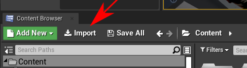
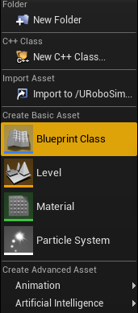
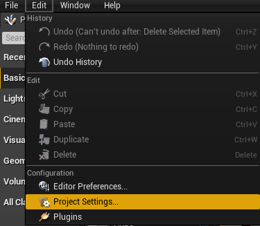
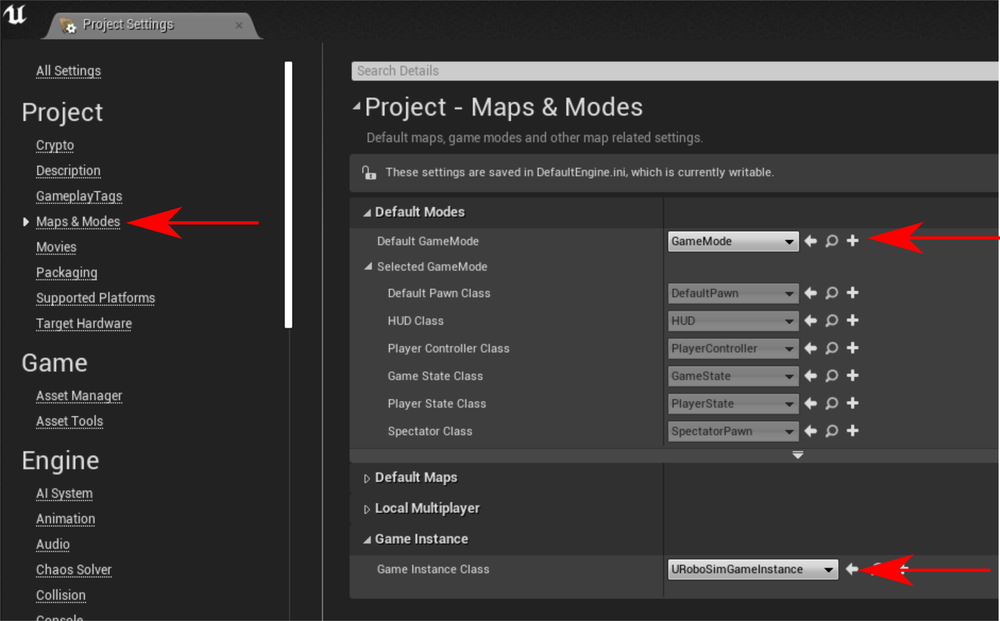
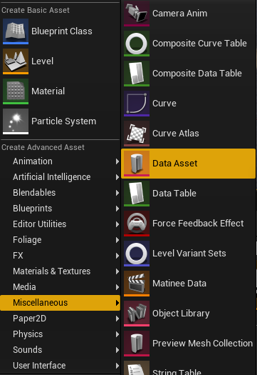
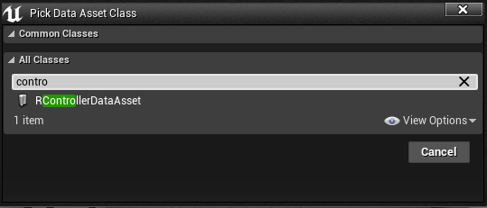
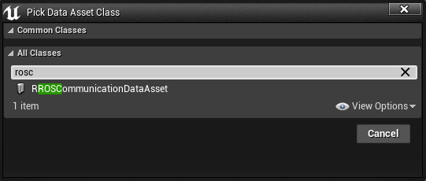

# URoboSim

* Unreal Engine 4 based robot simulator with ROS integration
* UE Version: **4.27**
* Version using [SDF](http://sdformat.org/) for loading robots.
See `gzsdf` for converting `URDF` to `SDF`.

## PR2 example: ##

    

* drag and drop a compatible `urdf` in the content menu:

    

* drag and drop the the generated `urdf data asset` file in the world:

    

* resulting generated robot model:

    

**Plugin Dependencies**

*  [UUtils](https://github.com/urobosim/UUtils)
*  [UROSWorldControl](https://github.com/urobosim/UROSWorldControl)
*  [UROSBridge](https://github.com/urobosim/UROSBridge)
*  [URoboVision](https://github.com/urobosim/URoboVision)

**Installation**

*  place the URobosim into the plugin folder of your project
*  place all plugin dependencies into the plugin folder of your project
*  add URoboSim as dependency to the *.Build.cs

**ROS requirements**

*  install ROS (tested on kinetic)
*  install [rosbridge_suite](https://wiki.ros.org/rosbridge_suite)
*  add [urobosim_msgs](https://github.com/urobosim/urobosim_msgs) to your workspace

**Tools**

*  [Github Organization](https://github.com/urobosim)
*  [Msg Generation](https://github.com/urobosim/MsgGeneration)
*  [Action Generation](https://github.com/urobosim/UROSActionLib)
*  [ROS configuration Example](https://github.com/urobosim/urobosim_ros_config)

**Setup Editor**

* open [Editor Settings](https://docs.unrealengine.com/4.27/en-US/Basics/UI/EditorSettings/)
* search for CPU
* disable "Use less CPU when in Background"

**Importing new Robot Model**
* convert xacro to urdf:  `rosrun xacro xacro --inorder -o model.urdf model.urdf.xacro`
* convert urdf to sdf: `gz sdf -v 1.6 -p /my_urdf.urdf > /my_sdf.sdf`
* replace ' with ": `sed -i "s/'/\"/g" my_sdf.sdf`

* convert .stl and .dae files to .fbx
    * you can use this blender script (experimental state) [FBX conversion](https://github.com/code-iai/ConvertMeshToFBX)

* Source ROS environment before starting UE4. 
    * Currently only ros python tool "catkin build" supported (catkin_make creates different ROS_PACKAGE_PATH which unreal uses to finds all ros packages)
* Start unreal
* Create [Collision channel](https://docs.unrealengine.com/4.27/en-US/InteractiveExperiences/Physics/Collision/HowTo/AddCustomCollisionType/) Robot in new Projects 
* Click import

* Select sdf
* Tick combine meshes
* Click ImportAll (if first mesh does not include textures the rest will be loaded without texture. Workaround: click import until mesh with texture is imported) 

* Drag and drop the created asset into the world (while dragging wait for the mesh creation to be finished before dropping the model)

**Setup GameInstance**

* Create Blueprint of RoboSimGameInstance or adjust URoboSimGameInstance of the URoboSim Content

* Open the Project Settings (Edit > ProjectSettings)

* In Maps & Modes set
    * Default GameMode to GameMode
    * GameInstance to the RoboSimGameInstance

**Add Controller**

* create new data asset, right click into ContentBrowser > Miscellaneous > Data Asset

* search for RControllerDataAsset

* double click on the created asset
* add robot name and controller configurations
* drag and drop the config file into the world

<!---
*  add RControllerComponent to the model
*  add new element to the ControllerList (Left field: Controller Name, Right field: Controller Type)
*  BaseController:
    *  Base Name: Name of the Base
*  JointController:
    *  Base Link: same as BaseController Base Name
    *  DesiredJointState: TMap of the desired joint angles, can be set manually
       or by adding a RJointControllerConfigurationClient to the
       ROSCommunication Component
*  CameraController:
    *  CameraRef: Name of the Reference Link
    *  Camera Name: Name of the Camera (Placed in the world)
    *  Perceived Object: List of Perceived object, used for fake perception
    *  PoseOffset: offset of the camera from ReferenceFrame
*  HeadController
*  GripperController(only tested on PR2):
    *  GripperCompSetting: Setting of the Gripper Component (ReferenceFrame, Offset)
    *  Right/LeftJointName:
    *  Right/LeftFingerTipName
    *  GraspComponent: Name of the GraspComponent (GraspComponent has to be added to model)
--->

**Add ROSCommunication**

* create new data asset, right click into ContentBrowser > Miscellaneous > Data Asset
* search for RROSCommunicationDataAsset

* double click on the created asset
* add robot name and communication configurations
* drag and drop the config file into the world

<!---
* Publisher:
    * OdometriePublisher:
        * Publishes the odometrie of the robot
        * FrameTransform: Position of the origin of the odometrie
        * MapFrameId: Name of the map frame
        * OdomFrameId: Name of the odometrie frame
        * BaseFrameId: Name of the base frame of the robot
        * Topic: Name of the topic to publish the odometrie
    * JointStatePublisher:
        * Publishes the current joint state of the robot
        * JointParamTopic: Name of the topic inside the parameter server
          containing the joints to be published
        * Topic: Name of the topic on which is published
    * R2DLidarPublisher:
        * Publishes the lidar measurement
        * SensorName: Name of the lidar sensor
        * Topic: Name of the topic on which is published
    * RJointTrajectoryControllerStatePublisher:
        * Publishes the state of the JointController (necessary for Giskard)
        * JointParamTopic: Name of the topic inside the parameter server
          containing the joints to be controlled by giskard
        * Topic: Name of the topic on which is published
* Subscriber:
    * RVelocityCommandSubscriber
        * Listens to the velocity commands and sets the desired velocity for the
          URBaseController (URBaseController in ControllerComponent has to be
          called "BaseController")
* Client:
    * URJointControllerConfigurationClient:
        * Configures the DesirdJoints (actuated joints) of the JointController
        * JointParamTopic: Name of the topic inside the parameter server
          containing the actuated joints
* Action:
    * URFollowJointTrajectoryActionServer:
        * Actions server for the FollowJointTrajectoryAction
        * Type: control_msgs/FollowJointTrajectoryAction
        * FeedbackPublisher -> JointParamTopic: Name of the topic inside the parameter server
          containing the joints to be controlled by giskard
        * ControllerName: Name of the JointController
        * ActionName: Name of the action
    * URGripperCommandActionServer:
        * Actions server for the GripperAction
        * Type: pr2_controllers_msgs/Pr2GripperAction
        * ControllerName: Name of the GripperController
        * ActionName: Name of the action
    * URPerceiveObjectActionServer:
        * Actions server for the fake perception
        * Type: urobosim_msgs/PerceiveObjectAction
        * ControllerName: Name of the CameraController
        * ActionName: Name of the action
    * URPointHeadActionServer:
        * Actions server for the HeadAction
        * Type: control_msgs/PointHeadAction
        * ControllerName: Name of the HeadController
        * ActionName: Name of the action

**Example Workflow**

*

--->

**FQA**

* The robot in dynamic mode wobbles/moves strange
	* Unreal has problems with long kinematic chains
	* Try optimizing the joint controller parameters 
	* Try small changes in joint space large changes might lead to overswinging
